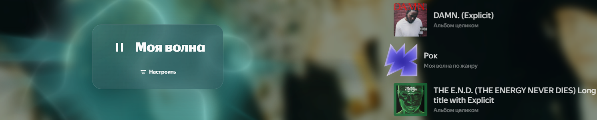

# Yandex Music Old Home UI

Аддон для PulseSync, который реализует логику **старого интерфейса Моей волны** на главной странице Яндекс Музыки. **ДЛЯ РАБОТЫ ВКЛЮЧИТЬ В ЭКСПЕРИМЕНТАХ `WebNextNewWaveTab`**

Поддерживает большинство тем, в том числе `ChromaSync`

Сейчас аддон делает следующее:

- добавляет собственный блок управления
- возвращает кнопку `Моя волна`
- возвращает кнопку `Настроить`
- по нажатию на `Настроить` скрывает и возвращает `.swiper` с плавной анимацией

## Ограничения

- аддон завязан на текущую DOM-структуру Яндекс Музыки
- часть логики все еще опирается на поиск кнопок в интерфейсе
- при заметных изменениях верстки селекторы могут потребовать обновления
