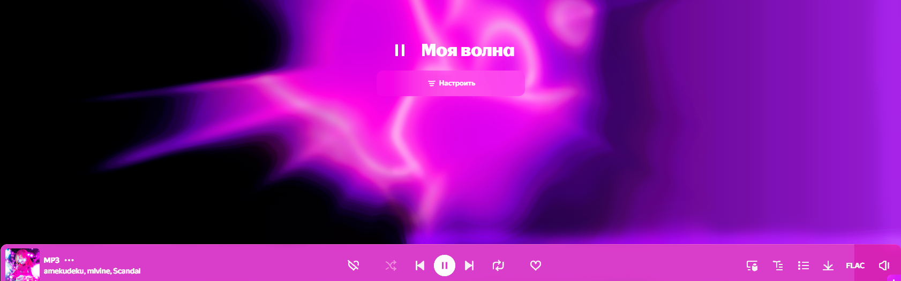

# Yandex Music Old Home UI

Аддон для PulseSync, который Реализует логику старого иинтерфейса Моей волны на главной странице Яндекс Музыки. ДЛЯ РАБОТЫ ВКЛЮЧИТЬ В ЭКСПЕРИМЕНТАХ `WebNextNewWaveTab` и `Настройки → Панель Плеера → Старая панель в новой Волне`

Поддерживает большинство тем, в том числе `ChromaSync`

При использовании с ChromaSync нужно либо сделать все фильтры в данном аддоне дефолтными, либо выключить кастомный цвет Волны в самом ChromaSync, так как они конфликтуют.

Сейчас аддон делает следующее:

- добавляет собственный блок управления
- возвращает кнопку `Моя волна`
- возвращает кнопку `Настроить`
- по нажатию на `Настроить` скрывает и возвращает `.swiper` с плавной анимацией
- скрывает всякий визуальный мусор
